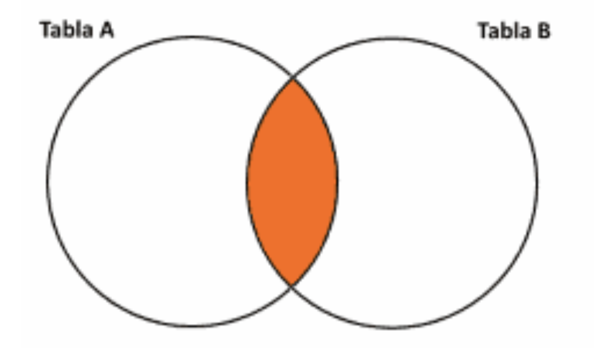
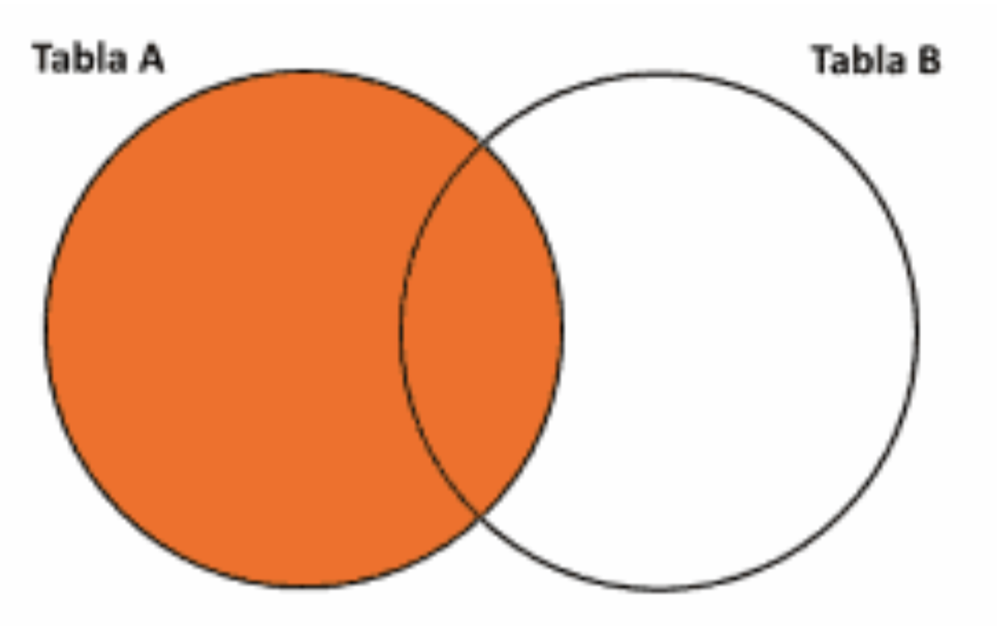
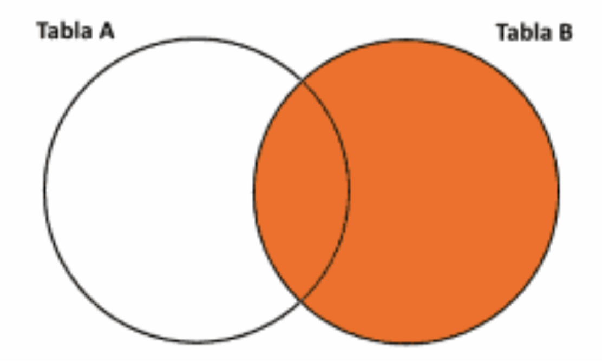
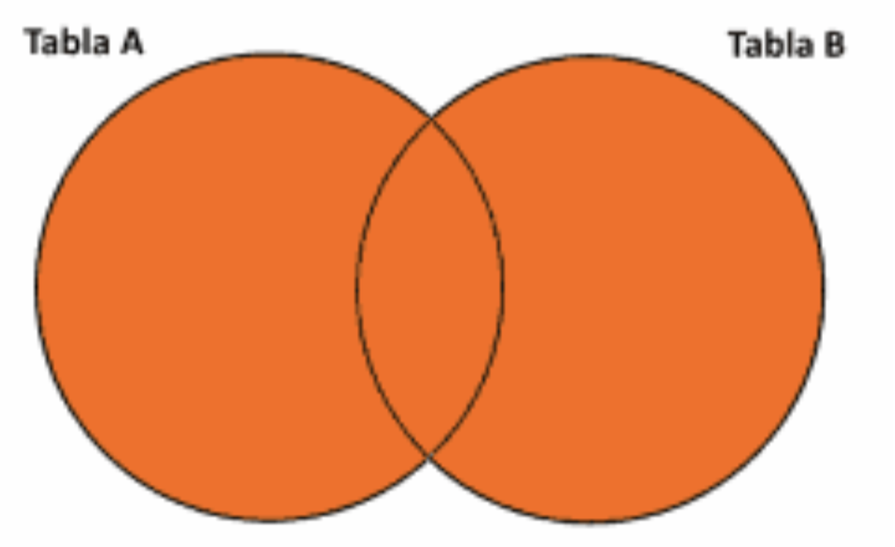

## Primera parte

### 1. ¿A qué se denomina JOIN en una base de datos?
Es una sentencia utilizada para unir o combinar registros y datos de una tabla con los de otra a partir de un elemento (una columna) en común. De manera que, esta asociación va a permitir la obtención de registros de ambas tablas.

### 2. Nombre y explique 2 tipos de JOIN.
#### INNER JOIN
Se aplica al no indicar algo adicional a la consulta y selecciona todos los registros que tienen valores coincidentes en ambas tablas.

#### RIGHT JOIN
Se utiliza en los casos en los que además de necesitar las filas o registros con valores coincidentes en ambas tablas, también se necesite la información de la tabla derecha (tabla A).

### 3. ¿Para qué se utiliza el GROUP BY?
Se utiliza para agrupar los valores de una columna específica (aunque esta sentencia puede usarse también con más de un nombre de columna). A menudo, se utilizan funciones agregadas con esta declaración.

### 4. ¿Para qué se utiliza el HAVING?
Es similar a WHERE, en tanto que ambos eliminan datos no deseados de un informe, pero, HAVING no afecta las filas de la tabla, sino, los grupos obtenidos a partir de la cláusula anteriorente nombrada GROUP BY. 

### 5. Dado los siguientes diagramas indique a qué tipo de JOIN corresponde cada uno:

<p align="center">
<table>
  <tr>
    <td> <b> Intersección (A∩B) </b> </td>
    <td> <b> Diferencia (A-B) </b> </td>
  </tr>
  <tr>
    <td></td>
    <td></td>
  </tr>
 </table>
 </p>

### Escriba una consulta genérica por cada uno de los diagramas a continuación:
 
<p align="center">
<table>
  <tr>
    <td> <b> Diferencia (B-A) </b> </td>
    <td> <b> Unión (AUB) </b> </td>
  </tr>
  <tr>
    <td></td>
    <td></td>
  </tr>
 </table>
 </p>

### Consultas genéricas
### Unión (AUB)
```mysql
SELECT  genre_id mo
FROM movies mo
UNION
SELECT id gen
FROM genres gen;
```

### Diferencia (B-A)
```mysql
SELECT  *
FROM movies mo
RIGHT JOIN actors ac
ON mo.id = ac.favorite_movie_id;
```