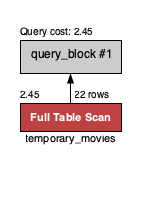
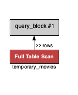

##  :closed_lock_with_key: SQL 3 - :movie_camera: Movies DB :school_satchel::books:

#### 1. Explicar el concepto de normalización y para que se utiliza.
La normalización es un proceso estandarizado en el que se aplican una serie de reglas para organizar la base de datos, de manera que, se eliminan redundancias e inconsistencias de dependencia en el diseño de las tablas, evitando así la realización de queries o consultas innecesariamente complejas además de proteger la integridad, favorecer la interpretación y eficiencia para quien la gestione.

#### 2. Agregar una película a la tabla movies.
```mysql
INSERT INTO `movies` 
VALUES (23,timestamp '2020-09-26 21:22:23',CURRENT_TIMESTAMP,'Buscando a Nemo',7.9,3,'2010-10-04 00:00:00',120,5);
```

#### 3. Agregar un género a la tabla genres.
```mysql
INSERT INTO `genres` 
VALUES (13,timestamp '2019-06-21 02:00:26',CURRENT_TIMESTAMP,'Romántico',13,1);
```

#### 4. Asociar a la película del Ej 2. con el género creado en el Ej. 3.
```mysql
UPDATE movies
SET genre_id = 13 
WHERE title = "Buscando a Nemo" AND rating = 7.9 AND id <> 0;

-- Otra opción
SET SQL_SAFE_UPDATES = 0;
UPDATE movies
SET genre_id = 13
WHERE last_name = "Buscando a Nemo" AND rating = 7.9;
SET SQL_SAFE_UPDATES = 1;
```

#### 5. Modificar la tabla actors para que al menos un actor tenga como favorita la película agregada en el Ej.2.
```mysql
UPDATE actors
SET favorite_movie_id = 20
WHERE last_name = 'Ackles' AND id <> 0;

-- Otra opción
SET foreign_key_checks = 0 ;
UPDATE actors
SET favorite_movie_id = 22
WHERE first_name = 'Jensen' AND last_name = 'Ackles';
SET foreign_key_checks = 1;
SET SQL_SAFE_UPDATES = 1;
```

#### 6. Crear una tabla temporal copia de la tabla movies.
```mysql
CREATE TEMPORARY TABLE temporary_movies AS
(SELECT * FROM movies);

SELECT * FROM temporary_movies;
```

#### 7. Eliminar de esa tabla temporal todas las películas que hayan ganado menos de 5 awards.
```mysql
DELETE FROM temporary_movies WHERE awards < 5;
```

#### 8. Obtener la lista de todos los géneros que tengan al menos una película.
```mysql
CREATE TEMPORARY TABLE temporary_gen
SELECT gen.name, COUNT(*) as cantidad_peliculas FROM genres gen
INNER JOIN movies mo
ON gen.id = mo.genre_id
GROUP BY gen.name
HAVING cantidad_peliculas >= 1;

SELECT * FROM temporary_gen;
```

#### 9. Obtener la lista de actores cuya película favorita haya ganado más de 3 awards. 
```mysql
CREATE TEMPORARY TABLE temporary_act
SELECT DISTINCT(ac.first_name), ac.last_name
FROM actors ac
INNER JOIN actor_movie ac_mo ON ac.id = ac_mo.actor_id
INNER JOIN movies mo ON ac_mo.movie_id = mo.id
WHERE mo.awards > 3;

SELECT * FROM temporary_act;
```

#### 10. Utilizar el explain plan para analizar las consultas del Ej.6 y 7.

#### Explain plan Ej.6
<p align="center">
  
</p>


```mysql
{
  "query_block": {
    "select_id": 1,
    "cost_info": {
      "query_cost": "2.45"
    },
    "table": {
      "table_name": "temporary_movies",
      "access_type": "ALL",
      "rows_examined_per_scan": 22,
      "rows_produced_per_join": 22,
      "filtered": "100.00",
      "cost_info": {
        "read_cost": "0.25",
        "eval_cost": "2.20",
        "prefix_cost": "2.45",
        "data_read_per_join": "33K"
      },
      "used_columns": [
        "id",
        "created_at",
        "updated_at",
        "title",
        "rating",
        "awards",
        "release_date",
        "length",
        "genre_id"
      ]
    }
  }
}
```

#### Explain plan Ej.7
<p align="center">
  
</p>


```mysql
{
  "query_block": {
    "select_id": 1,
    "table": {
      "delete": true,
      "table_name": "temporary_movies",
      "access_type": "ALL",
      "rows_examined_per_scan": 22,
      "filtered": "100.00",
      "attached_condition": "(`movies_db`.`temporary_movies`.`awards` < 5)"
    }
  }
}
```

#### 11. ¿Qué son los índices? ¿Para qué sirven?
Son estructuras de datos que se crean con la sentencia CREATE INDEX y mejoran la velocidad de recuperación de datos de las tablas, son utilizados para la optimización de consultas, la mejora sustancial de tiempos de respuesta en queries complejar, porque mejoran el acceso a los datos y evitan escaneos de los datos de una tabla. 

#### 12. Crear un índice sobre el nombre en la tabla movies.
```mysql
CREATE INDEX movies_title_idx
ON movies (title);
```

#### 13. Chequee que el índice fue creado correctamente.
```mysql
SHOW INDEX FROM movies;
```
