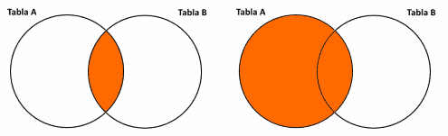

1. ¿A qué se denomina JOIN en una base de datos?
    - Una conexión (Combinación) entre dos tablas a través de una o varias condiciones en común.
2. Nombre y explique 2 tipos de JOIN.
    - Inner Join: Es una intersección de dos tablas dada una condición, obteniendo la información que comparten ambas tablas.
    - Full Join: Es una unión de dos tablas dada una condición, obteniendo toda la información de ambas tablas
3. ¿Para qué se utiliza el GROUP BY?
    - Para obtener un agrupamiento y/o resumen por un campo o columna indicado.
4. ¿Para qué se utiliza el HAVING?
    - Es muy similar al WHERE, pero el WHERE solo se aplica a las condiciones de los campos de las tablas, mientras que el HAVING se aplica a las condiciones de los agrupamientos (por ese motivo se usa junto con el GROUP BY).
5. Dado los siguientes diagramas indique a qué tipo de JOIN corresponde cada uno:
    
    
    1. Inner Join
    2. Left Join
6. Escriba una consulta genérica por cada uno de los diagramas a continuación:
    
    
    1. Right Join:
        - SELECT * FROM usuarios RIGHT JOIN
    2. Full Join:
        - SELECT * FROM usuarios FULL JOIN 
