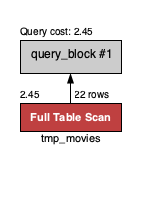
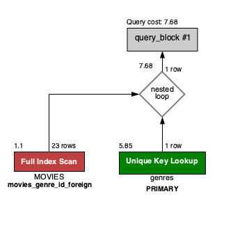
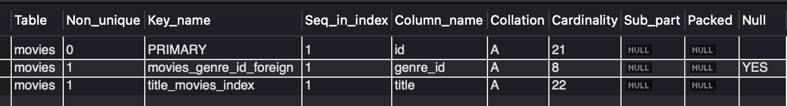

# Practica 1 | C3 - SQL TM

****SQL 3 - MOVIES DB****

Práctica Grupal

1. Explicar el concepto de normalización y para que se utiliza.
    
    La **normalización** es un proceso de estandarización y validación de datos que consiste en eliminar las redundancias o inconsistencias, completando datos mediante una serie de reglas que actualizan la información, protegiendo su integridad y favoreciendo la interpretación, para que así sea más simple de consultar y más eficiente para quien la gestiona.
    
2. Agregar una película a la tabla movies.

```sql
INSERT INTO `movies` (title,rating,awards,release_date,length,genre_id)
	VALUES ('Encanto', 9.1, 12, '2021-11-24 00:00:00', 109, 10);
```

3. Agregar un género a la tabla genres.

```sql
INSERT INTO `genres` (created_at, name, ranking, active)
	VALUES ('2005-07-03 22:00:00', 'Terror', 13, 1);
```

4. Asociar a la película del Ej 2. con el género creado en el Ej. 3.

```sql
UPDATE movies_db.movies
	SET genre_id = 13 
	WHERE title = "Encanto" AND id <> 0;
```

5. Modificar la tabla actors para que al menos un actor tenga como favorita la película agregada en el Ej.2.

```sql
UPDATE actors
	SET favorite_movie_id = 13
    WHERE first_name = 'Johnny' AND  last_name = 'Depp' AND id <> 0;
```

6. Crear una tabla temporal copia de la tabla movies.

```sql
CREATE TEMPORARY TABLE tmp_movies AS (SELECT * FROM movies);
```

7. Eliminar de esa tabla temporal todas las películas que hayan ganado menos de 5 awards.

```sql
SET SQL_SAFE_UPDATES = 0; -- Desactiva el modo 'Seguro'
DELETE FROM tmp_movies WHERE awards < 5;
SELECT * FROM tmp_movies;
SET SQL_SAFE_UPDATES = 1; -- Activa el modo 'Seguro'
```

8. Obtener la lista de todos los géneros que tengan al menos una película.

```sql
SELECT * FROM genres WHERE id IN (SELECT genre_id FROM MOVIES);
```

9. Obtener la lista de actores cuya película favorita haya ganado más de 3 awards.

```sql
SELECT * FROM actors WHERE favorite_movie_id IN (SELECT id FROM movies WHERE awards > 3);
```

10. Utilizar el explain plan para analizar las consultas del Ej.6 y 7.

| **Ejercicio 6** | **Ejercicio 7** |
|:-:|:-:|
|| |


11. ¿Qué son los índices? ¿Para qué sirven?

Se emplea un índice SQL para poder recuperar datos de una base de datos de una manera más rápida. Además:

- Son un mecanismo para **optimizar** consultas en SQL.
- Mejoran sustancialmente los tiempos de respuesta en Queries complejas.
- **Mejoran el acceso a los datos** al proporcionar una ruta más directa a los registros.
- Evitan realizar escaneos (barridas) completas o lineales de los datos en una tabla.
12. Crear un índice sobre el nombre en la tabla movies.

```sql
CREATE INDEX title_movies_index ON movies(title);
```

13. Chequee que el índice fue creado correctamente.

```sql
SHOW INDEX FROM movies;
```

Mostrando:

